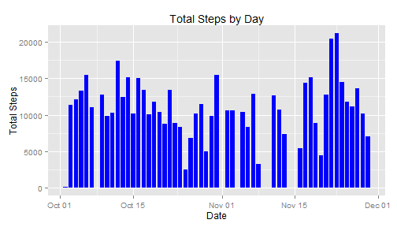
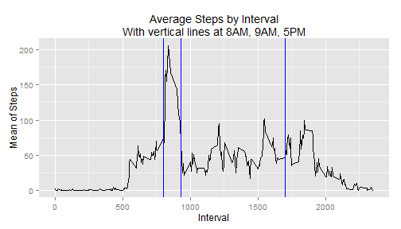
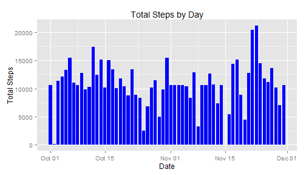
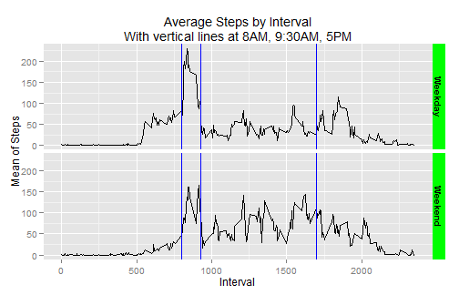

# Reproducible Research: Peer Assessment 1


## Loading and preprocessing the data
The data is in a compressed (zip) file named **activity.zip**. The data has 
three columns, steps, date, interval 

- **steps** the number of steps taken  
- **date** the date the data was recorded  
- **interval** the 5 minute interval for the data  


```r
# read the data from the zip file
activityData <- read.csv(unz("activity.zip", "activity.csv"),  
                         header=T, stringsAsFactor=F)
# set date as date format
activityData$date <- as.Date(activityData$date, format="%Y-%m-%d")
# create day column
activityData$day <- weekdays(activityData$date)
# get list of weekdays
y <- unique(activityData$day)
# set weekday set
weekday <- y[1:5]
# set weekend set
weekend <- y[6:7]
# recode day to weekday or weekend
activityData <- within(activityData, {day[day %in% weekday] <- "Weekday" 
                      day[day %in% weekend] <- "Weekend"})
# make it a factor
activityData$day <- factor(activityData$day)
# make a copy with only the complete cases
d1 <- complete.cases(activityData)
validActivityData <- activityData[d1,]
# summarize by date and then by interval
library(plyr)
activitySumDate <- ddply(validActivityData, .(date), summarize, 
                      totalSteps = sum(steps), 
                      meanSteps = mean(steps), 
                      medianSteps = median(steps) )
activitySumInterval <- ddply(validActivityData, .(interval), 
                             summarize, 
                             meanSteps = mean(steps) )
# find the interval with the highest mean steps value
maxSteps <- activitySumInterval[activitySumInterval$meanSteps == max(activitySumInterval$meanSteps),]
```


## What is mean total number of steps taken per day?

The mean and median steps per day are listed in the table below. Notice that the
median is 0 for all days. This is because 0 is the most frequent number of steps
in the data.

```r
 activitySumDate[,c(1,3,4)]
```

```
##          date meanSteps medianSteps
## 1  2012-10-02    0.4375           0
## 2  2012-10-03   39.4167           0
## 3  2012-10-04   42.0694           0
## 4  2012-10-05   46.1597           0
## 5  2012-10-06   53.5417           0
## 6  2012-10-07   38.2465           0
## 7  2012-10-09   44.4826           0
## 8  2012-10-10   34.3750           0
## 9  2012-10-11   35.7778           0
## 10 2012-10-12   60.3542           0
## 11 2012-10-13   43.1458           0
## 12 2012-10-14   52.4236           0
## 13 2012-10-15   35.2049           0
## 14 2012-10-16   52.3750           0
## 15 2012-10-17   46.7083           0
## 16 2012-10-18   34.9167           0
## 17 2012-10-19   41.0729           0
## 18 2012-10-20   36.0938           0
## 19 2012-10-21   30.6285           0
## 20 2012-10-22   46.7361           0
## 21 2012-10-23   30.9653           0
## 22 2012-10-24   29.0104           0
## 23 2012-10-25    8.6528           0
## 24 2012-10-26   23.5347           0
## 25 2012-10-27   35.1354           0
## 26 2012-10-28   39.7847           0
## 27 2012-10-29   17.4236           0
## 28 2012-10-30   34.0938           0
## 29 2012-10-31   53.5208           0
## 30 2012-11-02   36.8056           0
## 31 2012-11-03   36.7049           0
## 32 2012-11-05   36.2465           0
## 33 2012-11-06   28.9375           0
## 34 2012-11-07   44.7326           0
## 35 2012-11-08   11.1771           0
## 36 2012-11-11   43.7778           0
## 37 2012-11-12   37.3785           0
## 38 2012-11-13   25.4722           0
## 39 2012-11-15    0.1424           0
## 40 2012-11-16   18.8924           0
## 41 2012-11-17   49.7882           0
## 42 2012-11-18   52.4653           0
## 43 2012-11-19   30.6979           0
## 44 2012-11-20   15.5278           0
## 45 2012-11-21   44.3993           0
## 46 2012-11-22   70.9271           0
## 47 2012-11-23   73.5903           0
## 48 2012-11-24   50.2708           0
## 49 2012-11-25   41.0903           0
## 50 2012-11-26   38.7569           0
## 51 2012-11-27   47.3819           0
## 52 2012-11-28   35.3576           0
## 53 2012-11-29   24.4688           0
```

This is a histogram of the total steps taken by day.  There are a few days that
do not have data due primarily to the NA values. 

```r
library(ggplot2)
ggplot(activitySumDate, aes(x=date,y=totalSteps )) + 
      geom_histogram(stat="identity", fill="blue",width=0.8) + 
      ggtitle("Total Steps by Day") + 
      ylab("Total Steps") + xlab("Date")
```

 

## What is the average daily activity pattern?

The most steps occurred at interval 835 and has a mean value of 206.1698 steps.

This is a plot of the average number of steps taken by 5 minute interval across all days. 

```r
library(ggplot2)
ggplot(activitySumInterval, aes(x=interval,y=meanSteps)) + 
      geom_line() +
      geom_vline(x=c(800,930,1700), colour="blue") +
      ggtitle("Average Steps by Interval\nWith vertical lines at 8AM, 9AM, 5PM") +
      ylab("Mean of Steps") + xlab("Interval")
```

 

## Imputing missing values
To recode the missing values a function was written to set the NA value to the
mean for the corresponding interval value.  

```r
# how many NA values are in the steps variable?
naSteps <- sum(is.na(activityData$steps))
# merge the original and the summarized interval values for use in recoding NA's
copyActivityData <- merge(activityData,activitySumInterval, by="interval")
# define function to recode NA's
newStep <- function(data){
      for (i in 1:nrow(data)) {
            if (is.na(data$steps[i])) {
                  data$steps[i] <- floor(data$meanSteps[i])
            }
      }
      return(data)
}
# use function to recode NA values to mean for that interval
newActivityData <- newStep(copyActivityData)
#
library(plyr)
newActivitySumDate <- ddply(newActivityData, .(date), summarize, 
                      totalSteps = sum(steps), 
                      meanSteps = mean(steps), 
                      medianSteps = median(steps) )
activitySumIntervalDay <- ddply(newActivityData, .(interval,day), 
                                summarize, 
                                meanSteps = mean(steps))
```

There are 2304 NA values in the steps variable from the original data. 

Here is a histogram of the activity data with the recoded values for the NA steps.

```r
# plot the data
library(ggplot2)
ggplot(newActivitySumDate, aes(x=date,y=totalSteps)) + 
      geom_histogram(stat="identity",fill="blue", width=0.8) +
      ggtitle("Total Steps by Day") +
      ylab("Total Steps") + xlab("Date")
```

 


The below table shows the mean and median with the recoded values. One noticable 
difference is that the days that had NA values now show up in the table with a 
median value that is not zero. Oddly enough they all have a median of 33.5. 

```r
 newActivitySumDate[,c(1,3,4)]
```

```
##          date meanSteps medianSteps
## 1  2012-10-01   36.9479        33.5
## 2  2012-10-02    0.4375         0.0
## 3  2012-10-03   39.4167         0.0
## 4  2012-10-04   42.0694         0.0
## 5  2012-10-05   46.1597         0.0
## 6  2012-10-06   53.5417         0.0
## 7  2012-10-07   38.2465         0.0
## 8  2012-10-08   36.9479        33.5
## 9  2012-10-09   44.4826         0.0
## 10 2012-10-10   34.3750         0.0
## 11 2012-10-11   35.7778         0.0
## 12 2012-10-12   60.3542         0.0
## 13 2012-10-13   43.1458         0.0
## 14 2012-10-14   52.4236         0.0
## 15 2012-10-15   35.2049         0.0
## 16 2012-10-16   52.3750         0.0
## 17 2012-10-17   46.7083         0.0
## 18 2012-10-18   34.9167         0.0
## 19 2012-10-19   41.0729         0.0
## 20 2012-10-20   36.0938         0.0
## 21 2012-10-21   30.6285         0.0
## 22 2012-10-22   46.7361         0.0
## 23 2012-10-23   30.9653         0.0
## 24 2012-10-24   29.0104         0.0
## 25 2012-10-25    8.6528         0.0
## 26 2012-10-26   23.5347         0.0
## 27 2012-10-27   35.1354         0.0
## 28 2012-10-28   39.7847         0.0
## 29 2012-10-29   17.4236         0.0
## 30 2012-10-30   34.0938         0.0
## 31 2012-10-31   53.5208         0.0
## 32 2012-11-01   36.9479        33.5
## 33 2012-11-02   36.8056         0.0
## 34 2012-11-03   36.7049         0.0
## 35 2012-11-04   36.9479        33.5
## 36 2012-11-05   36.2465         0.0
## 37 2012-11-06   28.9375         0.0
## 38 2012-11-07   44.7326         0.0
## 39 2012-11-08   11.1771         0.0
## 40 2012-11-09   36.9479        33.5
## 41 2012-11-10   36.9479        33.5
## 42 2012-11-11   43.7778         0.0
## 43 2012-11-12   37.3785         0.0
## 44 2012-11-13   25.4722         0.0
## 45 2012-11-14   36.9479        33.5
## 46 2012-11-15    0.1424         0.0
## 47 2012-11-16   18.8924         0.0
## 48 2012-11-17   49.7882         0.0
## 49 2012-11-18   52.4653         0.0
## 50 2012-11-19   30.6979         0.0
## 51 2012-11-20   15.5278         0.0
## 52 2012-11-21   44.3993         0.0
## 53 2012-11-22   70.9271         0.0
## 54 2012-11-23   73.5903         0.0
## 55 2012-11-24   50.2708         0.0
## 56 2012-11-25   41.0903         0.0
## 57 2012-11-26   38.7569         0.0
## 58 2012-11-27   47.3819         0.0
## 59 2012-11-28   35.3576         0.0
## 60 2012-11-29   24.4688         0.0
## 61 2012-11-30   36.9479        33.5
```

## Are there differences in activity patterns between weekdays and weekends?
A new variable has been set to **weekend** or **weekday** based on the day of the week. 
Saturday and Sunday are used for the weekend and all others for the weekday. 

The weekday plot shows a sharp spike around 8-9am with moderate activity until 
later in the day then a drop in activity. For the weekend there is a smaller spike around 
the 8-9am time followed by generally more activity through out the day. 


```r
ggplot(activitySumIntervalDay, aes(x=interval,y=meanSteps)) + 
      geom_line() + 
      facet_grid(day ~ .) +
      geom_vline(x=c(800,930,1700), colour="blue") + 
      ggtitle("Average Steps by Interval\nWith vertical lines at 8AM, 9AM, 5PM") +
      ylab("Mean of Steps") + xlab("Interval") +
      theme(strip.text = element_text(face="bold"),
            strip.background = element_rect(fill="green"))
```

 
